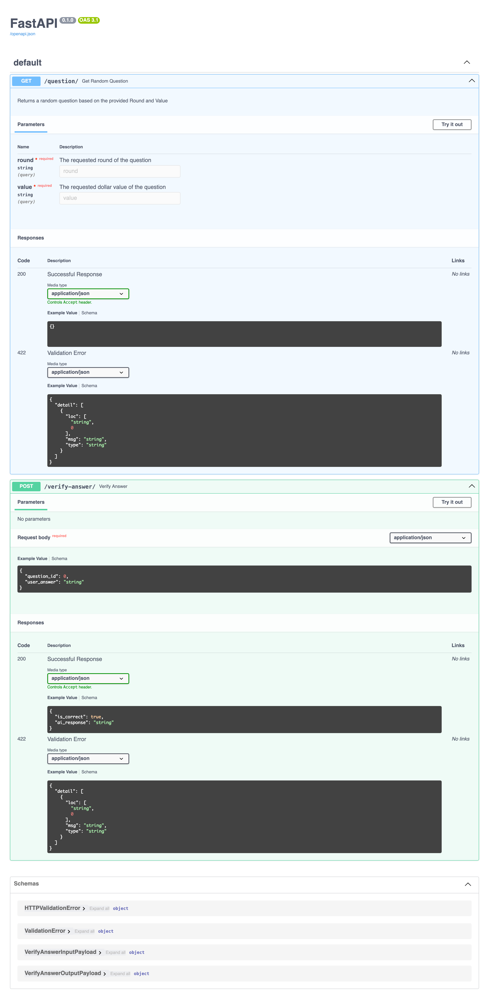

# jeopardy
A simple backend service that allows players to pick random "Jeopardy!" questions and submit answers for evaluation

## Starting the service, locally (dev mode)

1. Setup a new Python 3.12 venv using your favorite env manager
2. In the repo root, install the project requirements: `pip install -r jeopardy/requirements.txt`
3. Start the FastAPI server in dev mode: `fastapi dev jeopardy/server_main.py`
   1. On the initial startup, the dataset will be downloaded and ingested into a local DB
   2. Subsequent startups will optimistically skip the ingestion steps

## Development with `pants`
1. Install `pants`. Run `./toolchain/get-pants.sh` in the repo root
2. Run code inspections (isort, black, pylint, mypy, etc): `pants green ::`
3. Run unit tests: `pants test ::`

## API Documentation
Interactive OpenAPI documentation is available at http://127.0.0.1:8000/docs
